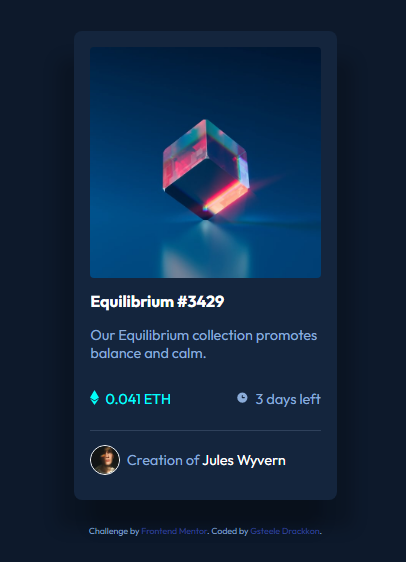

# Frontend Mentor - NFT preview card component solution

This is a solution to the [NFT preview card component challenge on Frontend Mentor](https://www.frontendmentor.io/challenges/nft-preview-card-component-SbdUL_w0U). Frontend Mentor challenges help you improve your coding skills by building realistic projects.

## Table of contents

- [Overview](#overview)
  - [The challenge](#the-challenge)
  - [Screenshot](#screenshot)
- [My process](#my-process)
  - [What I learned](#what-i-learned)
- [Acknowledgments](#acknowledgments)

## Overview
this was a fun one, im probably trying to dive into too many elements to start out but i am enjoying taking my time and learning different ways to do things and more universal elements rather than hardcoding certain things.
### The challenge

Users should be able to:

- View the optimal layout depending on their device's screen size
- See hover states for interactive elements

### Screenshot

### Links

- Solution URL: [Add solution URL here](https://your-solution-url.com)
- Live Site URL: (https://www.frontendmentor.io/challenges/nft-preview-card-component-SbdUL_w0U)

## My process
so for my 2nd project i tried to structure it more. so i thought about all the elements i needed, i got the basic html layout of the whole page then moved into styling. this sounds pretty straight forward structure but its a big step for me and my adhd ways of thinking about the style of something before i know how/why/where to correctly use it. then with css just really focused on 1 element until it was right before moving onto the next, or if i struggled i would realize im going nowhere so id take 5 from that element and move onto another. this though i found i would break things with code i doubled up or didnt delete. all in all happy witgh progress and excited for the next.

### What I learned

i learnt how to correctly use flex box, ive had a look at more pseudo commands but ill need more practice.

## Acknowledgments

the programmers hangout on discord is really helpful place
